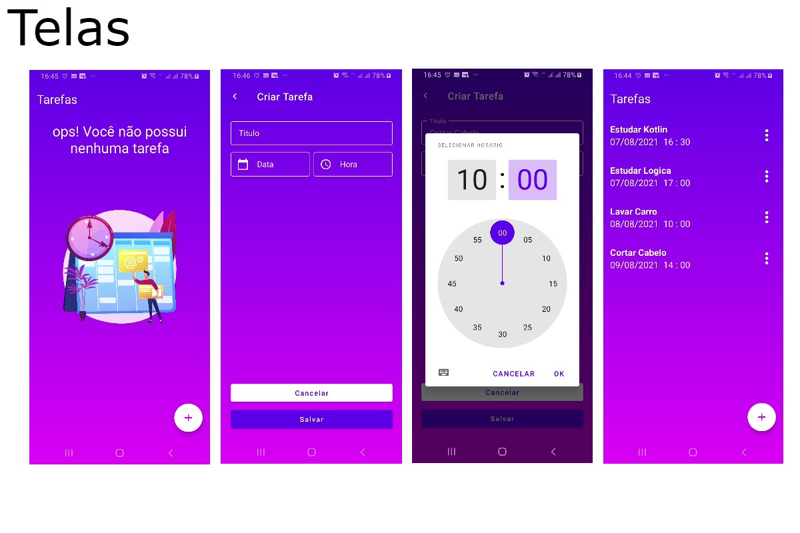

# Hello welcome

This was the project delivered at Bootcamp Santander Mobile Developer at DIO.

The project aims to create a To-do list App in Kotlin.

In this project, View Binding, RecyclerView, Popup menu, Empty States were used.

It was implemented as Challenge to make the application resilient that it doesn't lose the saved tasks when it is closed.

For this, we used SQLite using Room. In addition, the functionality of notifications was implemented.

The APP issues notifications when tasks are scheduled.

Feel free to look, I am open to tips and suggestions.

# Screens

Video Demo

https://user-images.githubusercontent.com/61300230/128618653-d9bb8799-fbd5-4010-aeb8-92906b4e00c8.mp4

